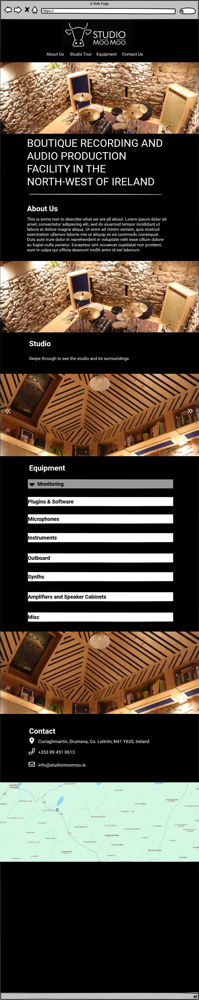
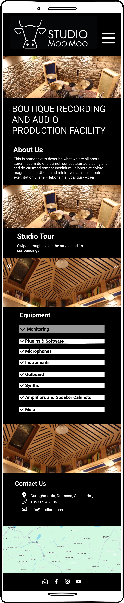
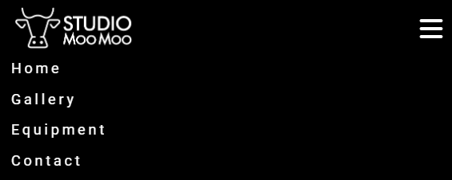
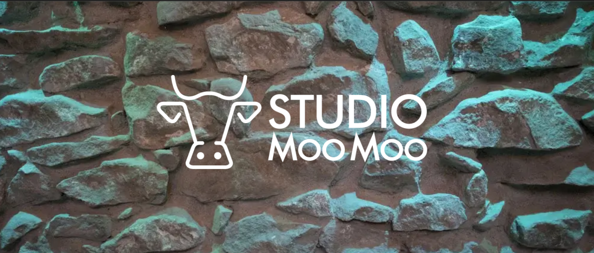
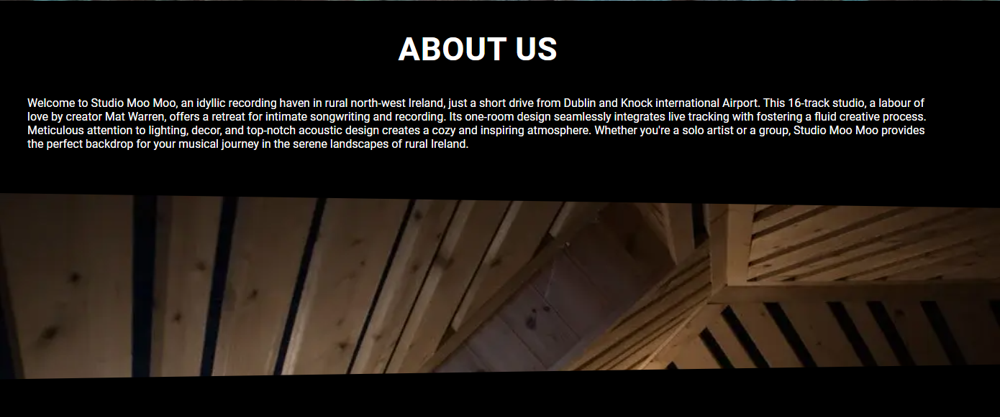
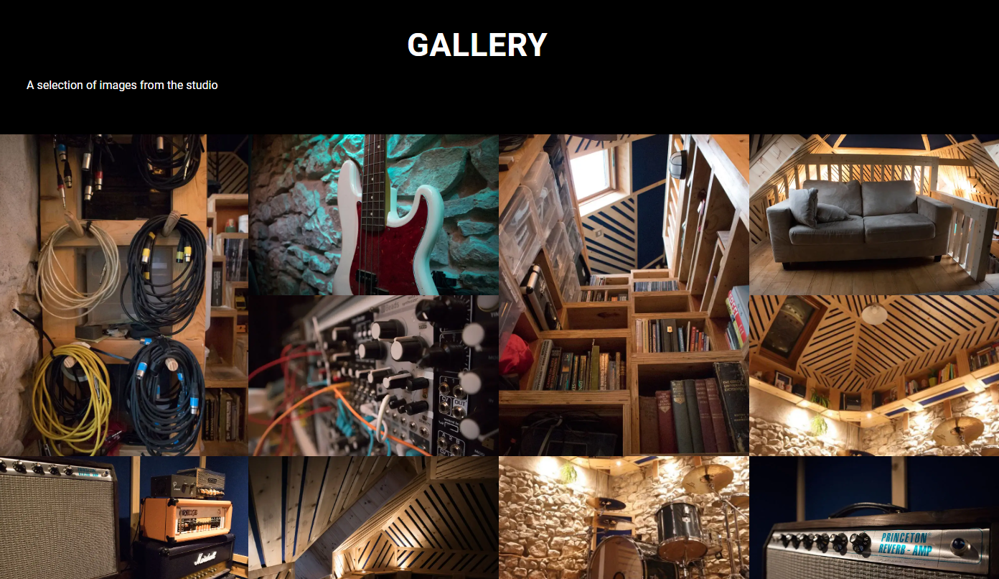
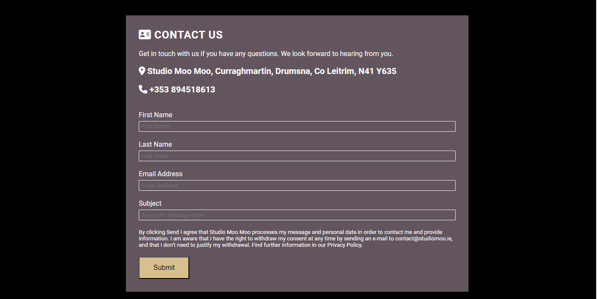
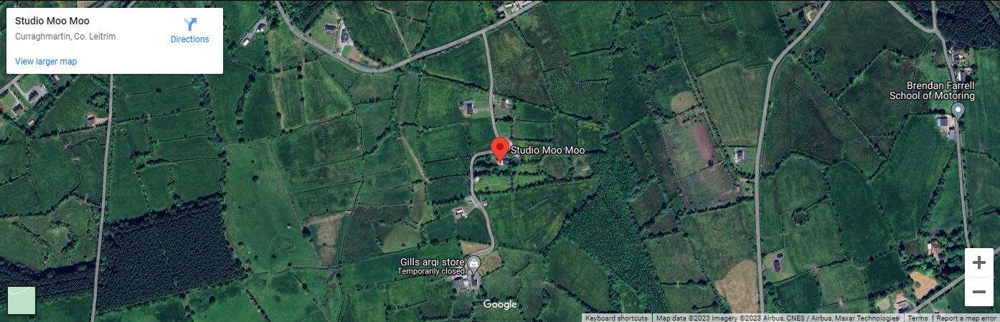
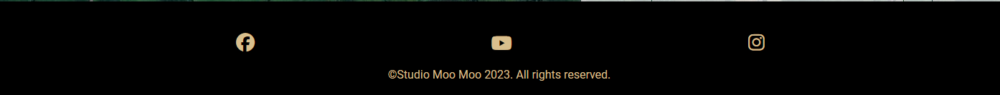

# Studio Moo Moo

Studio Moo Moo is a website that aims to promote a recording studio and audio production facility in the north-west of Ireland. It will be a basic site that will provide a good visual experience, clear images and information about the equipment and facilities. There will also be basic email contact form.

The live link can be found here - [Studio Moo Moo](https://astro-mat.github.io/PP1-studiomoomoo/)

## Site Owner Goals

- To provide the user with information about Studio Moo Moo both visual and textural. 
- To provide location details of the studio.
- To present the user with a website that is easy to navigate, fully responsive and invokes a sense of professionalism through the use of appropriate colours and imagery. 
- To enable the user to contact the studio for further information.

## User Stories
- ### First time user
    - As a first time user I want to quickly judge weather the studio meets my needs and easily contact them to ask further questions

- ### Frequent User
    - As a frequent user I want to be able to contact the studio and locate it when I need to visit. 

- ### Returning User
    - As a frequent user I want to be able to contact the studio and locate it when I need to visit. I want to be able to access the available equipment for my future needs. 

## Design

### Imagery
The imagery used on the Studio Moo Moo site is very important to convey to the user that this is a place that they would feel hapy to spend time creating music in. It must feature images demonstrating all aspects of the studio.

I chose a theme that is quite in line with the stone and wood that the studio is constructed from. I was also inspired by the imagery of modular synth manufacturers of which I have many.

### Colour scheme
The colour scheme of the website is predominantly black with high contrast white making it easy to read. There are elements of grey, brown and yellow to keep in line with the wood and stone imagery of the studios construction.

### Typography
The Robotto font is the main font used throughout the whole website. This font was imported via [Google Fonts](https://fonts.google.com/). I'm using Sans Serif as a backup font, in case for any reason the main font isn't being imported into the site correctly. I am also using [Font Awesome](https://fontawesome.com/) for icons throughout the site

### Wireframes
Wireframes were produced using Balsamiq. 

 
Desktop Wireframe

 

 

    
Mobile Wireframe

 

### Site Structure
The site will predominantly be a one-page site with a navigation menu in the header which moves with scrolling 

## Features
### Navigation

    - The fully responsive navigation bar includes links to Home, About us, Gallery and Contact all on the same page.
    - The navigation bar has a fixed position so that it remains visible at the top of the page as the user navigates through the individual sections. 
    - A drop shadow was applied to the navigation bar to make sure that it doesn't blend into the other sections of the page upon scrolling.
    - This section allows the user to easily navigate through the site to find content without having to scroll back up to the top of the page or use the browser back button.
    - For smaller screens, the nav bar reduces to a hamburger icon that when pressed, drops down to reveal the menu items.
Navbar Desktop

Navbar Small screen view

Navbar Small screen dropdown menu

### Hero image

 

### About Us

 

### Gallery

 

### Contact Us

 

 

### Footer

 

### Future Features
- Dropdown menu should be more dynamic. Should hide when you have scrolled to the next part of the page.
- A more comprehensive gallery section with option to increase size of image for a more detailed view.
- The contact page does not yet send information. It only goes to alanding page that takes the user back to the main page 

## Testing
### Code Validation
### Responsiveness
### Lighthouse testing
### Accessibility testing
### Manual testing

## Bugs
### Bugs Fixed
### Known Bugs
nav bar should hide after scrolling. Likely to be a javascript solution.

PROBLEMS
Image gallery takes long time to load

How to fork and clone

TESTING

Lighthouse

Performance
