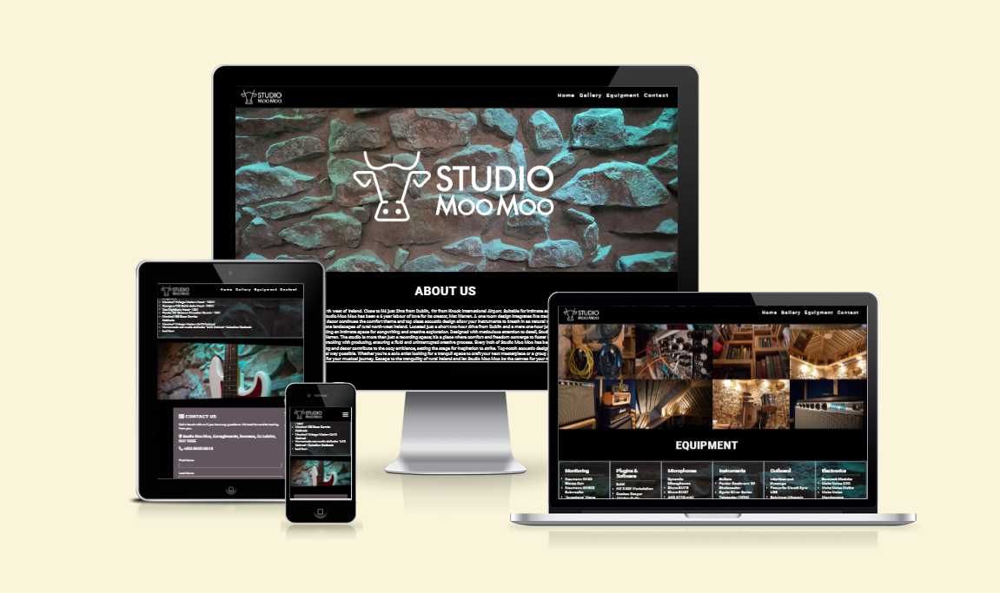

<h2>Project Introduction<h2>
○ Title
○ Description
○ Link to live site
<h2>User Experience<h2>
○ First time user experience
○ Returning user
○ PP4 & PP5 add detailed user stories.
<h2>Design</h2>
○ Wireframes
○ Site Structure
○ Imagery used
○ Colour Scheme
○ Typography
<h2>Features</h2>
○ Navigation
○ Future Features
<h2>Testing</h2>
○ Code Validation
○ Responsiveness
○ Lighthouse testing
○ Accessibility testing
○ Manual testing
<h2>Bugs</h2>
○ Bugs Fixed
○ Known Bugs

# Studio Moo Moo

Studio Moo Moo is a website that aims to promote a recording studio and audio production facility in the north-west of Ireland. It will be a basic site that will provide a good visual experience, clear images and information about the equipment and facilities. There will also be basic email contact form.

The live link can be found here - [Studio Moo Moo](https://astro-mat.github.io/PP1-studiomoomoo/)

##Site Owner Goals

- To provide the user with information about Studio Moo Moo both visual and textural. 
- To provide location details of the studio.
- To present the user with a website that is easy to navigate, fully responsive and invokes a sense of professionalism through the use of appropriate colours and imagery. 
- To enable the user to contact the studio for further information.

## User Stories
- ### First time user
    - As a first time user I want to quickly judge weather the studio meets my needs and easily contact them to ask further questions

- ### Frequent User
    - As a frequent user I want to be able to contact the studio and locate it when I need to visit. 

- ### Returning User
    - As a frequent user I want to be able to contact the studio and locate it when I need to visit. I want to be able to access the available equipment for my future needs. 

## Design

### Imagery
The imagery used on the Studio Moo Moo site is very important to convey to the user that this is a place that they would feel hapy to spend time creating music in. It must feature images demonstrating all aspects of the studio.

A nature theme is consistently used across all imagery with lots of green foliage and forest scenes. This gives the sense of grounding in nature which has great benefits for mental health and is intended to invoke a sense of calm in the user. The colour green is also important as this ties into the main colour scheme of the site. 

### Colours
The colour scheme of the website is white and green with varying shades of green used to tie in with the nature imagery. A dark grey font is used which has a good contrast with the light green and white backgrounds making it easy to read. 

### Fonts
The Montserrat font is the main font used throughout the whole website. This font was imported via [Google Fonts](https://fonts.google.com/). I'm using Sans Serif as a backup font, in case for any reason the main font isn't being imported into the site correctly.

PROBLEMS
Image gallery takes long time to load

How to fork and clone

TESTING

Lighthouse

Performance
